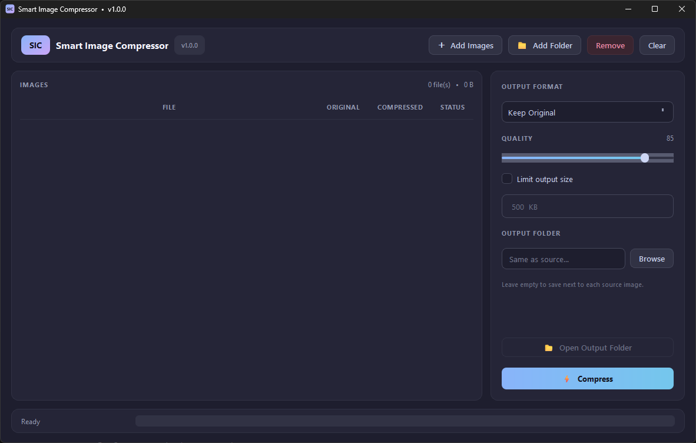

<!DOCTYPE html>
<html lang="en">
<head>
<meta charset="UTF-8" />
<meta name="viewport" content="width=device-width, initial-scale=1.0" />
<title>Smart Image Compressor (SIC)</title>
<meta name="description" content="A modern image compression tool built with PySide6 and Pillow." />

</head>
<body>

  <header class="hero">
    
SIC

    <h1>Smart Image Compressor</h1>
    
A modern, easy-to-use image compression tool built with PySide6 and Pillow.

    

      version 1.0.0
      python 3.9+
      license MIT
      PySide6
      Pillow
    

  </header>

  <section>
    <h2>Features</h2>
    

      
🎨 Clean, modern, dark-themed UI

      
🖼️ Batch compression — single, multiple, or whole folders

      
📁 Drag &amp; drop support

      
🎯 Smart target-size algorithm

      
🔀 Output format: Keep Original / JPEG / PNG / WebP

      
📉 Optional maximum output size (in KB)

      
📂 Custom or automatic output folder

      
⚡ Multi-threaded — UI never freezes

      
🛑 Cancel running jobs at any time

      
🧠 Alpha-aware JPEG handling (no black artifacts)

    

  </section>

  <section>
    <h2>Screenshot</h2>
    
    

      Add your screenshot at <code>screenshots/preview.png</code>
    

  </section>

  <section>
    <h2>Requirements</h2>
    <ul>
      <li>Python 3.9 or newer</li>
      <li>PySide6 &gt;= 6.6</li>
      <li>Pillow &gt;= 10.0</li>
    </ul>
  </section>

  <section>
    <h2>Installation</h2>
<pre><code>git clone https://github.com/ZvanTors/Smart-Image-Compressor.git
cd Smart-Image-Compressor
pip install -r requirements.txt</code></pre>
  </section>

  <section>
    <h2>Usage</h2>
<pre><code>python main.py</code></pre>
    <ol>
      <li>Click <strong>Add Images</strong> or <strong>Add Folder</strong> (or drag &amp; drop files/folders).</li>
      <li>Choose the output format and quality.</li>
      <li>(Optional) Enable <strong>Limit output size</strong> and set a target in KB.</li>
      <li>(Optional) Choose a custom output folder.</li>
      <li>Hit <strong>Compress</strong> — done!</li>
    </ol>
  </section>

  <section>
    <h2>How the &ldquo;max size&rdquo; mode works</h2>
    
When a target size is set, SIC:

    <ol>
      <li>Tries the original quality.</li>
      <li>If too big, binary-searches JPEG/WebP quality (7 iterations).</li>
      <li>If still too big, progressively downscales the image and repeats.</li>
      <li>Guarantees the result is under the target size, unless physically impossible.</li>
    </ol>
    

      <strong>Tip:</strong> For the smallest possible files without quality loss on photos,
      choose <em>WebP</em> — it typically beats JPEG by 25–35% at the same visual quality.
    

  </section>

  <section>
    <h2>Building a Windows executable</h2>
<pre><code>pip install pyinstaller
pyinstaller --noconfirm --onefile --windowed ^
  --name "SmartImageCompressor" main.py</code></pre>
    
The standalone executable will be created at <code>dist/SmartImageCompressor.exe</code>.

  </section>

  <section>
    <h2>Project structure</h2>
<pre><code>Smart-Image-Compressor/
├── main.py              # Application entry point
├── requirements.txt     # Python dependencies
├── README.html          # This page
├── LICENSE              # MIT License
├── .gitignore
└── screenshots/
    └── preview.png</code></pre>
  </section>

  <section>
    <h2>License</h2>
    
Released under the <a href="LICENSE">MIT License</a>.

  </section>

  <footer>
    Made with ❤️ using PySide6 &amp; Pillow &nbsp;·&nbsp; © 2025 Your Name
  </footer>

</body>
</html>